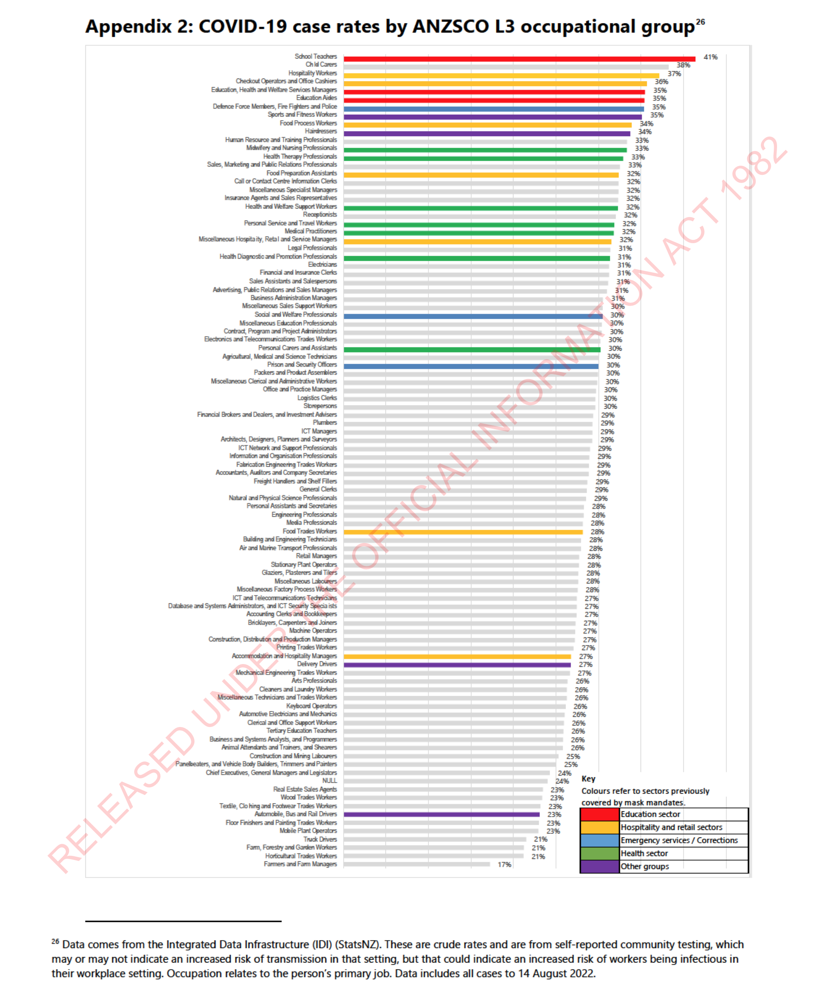

```{r setup, include=FALSE}
knitr::opts_chunk$set(echo = TRUE)
```

(technical note: the ReadMe.Rmd version of this file contains code for generating graphs etc not found in the general reading .md version of the file)

## Background and key data files

At the end of November 2022, the New Zealand government released the October Public Health Risk Assessment of Covid-19 report as a result of Official Information Act request.

<https://fyi.org.nz/request/20877-covid-19-monthly-public-health-risk-assessments>

In that OIA response was a graph of COVID-19 case rates by ANZSCO L3 occupational group (crown copyright)



As 98.6% of reported infections to mid-August 2022 were since mid-February, so I find it more useful to think of the graph as "Percent of occupations reporting covid infections in the first 6 months of Omicron"- As a rate per time period.

I digitised this file so that the numbers could be used. As this involved marking and measuring the bars on the graph I think most entries are more accurate than the rounded numbers, but some may be out from the full value by more than the rounded amount. If you came here for that file it is [bars.csv](bars.csv "bars.csv")

I also recalled that in April 2020 Figure.nz did an analysis of potential job effects of covid by linking O\*Net US pre-covid occupational surveys about the context of work to ANZSCO NZ occupational classifications at <https://www.notion.so/COVID-19-Job-Impacts-930f46b6cb934dd282f99007e310c010>

I thought it would be useful to redo the data linkage from the O\*net (CC-by 4.0) work context through the Figure.nz concordence (CC-by 4.0) to the occupational group infection rates. And as I think I am the first person to do this, if you want some comments around occupaitonal covid rates and job contexts, this is the right place.

If you just want this file, it is CC-BY-4.0 acknowledging O\*net, FigureNZ, StatsNZ, The New Zealand Government, and David Hood as [combined_data.csv](combined_data.csv "combined_data.csv")

Note that is file has the overview of the O\*net category result (generally as a column with a 5 point scale) followed by the subcategories of each answer choice for that category (as a percentage scale of the frequency of the answer being chosen). The subcategory columns are of the form Main category \_ answer option, while the Main category columns have no underscore in the column names.

```{r loadNeeded, echo=FALSE, message=FALSE, warning=FALSE}
library(readr)
library(dplyr)
library(tidyr)
library(ggplot2)
library(ggthemes)
library(stringr)
library(knitr)
library(RcppRoll)
library(lubridate)

theme_wkcv23 <- function(){
  # theme_minimal(base_family="OpenSans") %+replace% 
  theme_minimal(base_size = 6) %+replace% 
    theme(panel.grid.major.x = element_blank(),
          panel.grid.minor.x = element_blank(),
          axis.line.x = element_line(size=0.1),
          axis.text.x = element_text(size=6),
          axis.ticks.x = element_line(size=0.2),
          axis.line.y = element_line(size=0.1),
          axis.ticks.y = element_line(size=0.2),
          axis.text.y = element_text(size=6),
          strip.background = element_rect(fill= "#FFFFFF", colour="#EFEFEF"),
          strip.text = element_text(size = 6,
                                    margin = margin(t = 5, r = 5, b = 5, l = 5, unit = "pt")),
          strip.placement = "inside",
          panel.background = element_rect(fill = "#FFFFFF", colour = "#FFFFFF"),
          panel.spacing = unit(0.7, "lines"),
          plot.title = element_text(size = 8,
                                    lineheight = 1.23,
                                    margin=margin(t = 0, r = 0, b = 10, l = 10, unit = "pt"),
                                    hjust=0),
          plot.subtitle = element_text(size = 7, hjust=0),
          plot.background = element_rect(fill = "#F5F5F5"),
          axis.title = element_text(size=7),
          plot.caption = element_text(margin=margin(t = 5, r = 5, b = 5, l = 5, unit = "pt"),
                                      size=5, hjust=1),
          plot.caption.position = "plot",
          plot.margin = margin(12, 18, 12, 12, "pt"),
          legend.position = "none")
}
combined <- read_csv("combined_data.csv")
sixcols= colorblind_pal()(6)
```

## Talk slides

After linking all the data, one of the strongest relationship was the general category of "Close Contact". The more important close contact is as part of the job, the more of the workforce caugt Omicron in the first 6 months.

```{r closeContact, echo=FALSE, message=FALSE, warning=FALSE}

ggdata <- combined %>%
  select(1:2,`Contact With Others`)

graf <- ggplot(ggdata, aes(x=`Contact With Others`, y=Percentage_Covid)) +
  geom_smooth(method="lm", formula = 'y ~ x', se=TRUE, linewidth=0.5, colour=sixcols[1]) +
  geom_point(size=0.3, colour=sixcols[1]) + 
  geom_hline(yintercept = 24.01279463, colour=sixcols[2]) +
  annotate("text",x = max(ggdata$`Contact With Others`), y = 23.5, label="No known ANZSCO occupation", hjust=1, vjust=1, colour=sixcols[2])+
  labs(title="Occupational importance of Contact With Others (O*NET, pre-covid) vs.
Percentage of NZ workers catching covid by mid-August 2022 (NZ govt OIA)\n",
x="\nImportance of Contact With Others (5pt scale)\n",
y="\nPercentage of occupation group\ncatching covid\n") +
  scale_y_continuous(breaks=c(0,20,40), labels = c("none","some", "twice\nsome")) +
  coord_cartesian(y=c(0,NA)) +
  theme_wkcv23()
ggsave("~/Desktop/ContactwOthers.png", width=1920, height=1080, units = "px")
graf
```

I am deliberating labeling the amount of covid "none", "some", and "twice some" since there is under-reporting of cases, and it is the same angle of rise of covid if you multiply out the values to high estimates so the exact number is not too important. But for those who really want a number "some" is 20% and "twice some" is 40% (which should be read as "at least 20%" and "at least 40%"). And I think that variation makes an important point, we can get a doubling (or, more importantly by reading the graph in hte reverse direction, a halving) in the rate of cases not from fate or the genetics of the virus, but from the ways work is structured in different occupations.

Because it is more about the slope of the lines- how the number of infections change as the circumstances of work differ - we can contrast how different measures from the O\*net data affect reported cases.

```{r differCircumstance, echo=FALSE, message=FALSE, warning=FALSE}
ggdata <- combined %>%
  select(1:2,
         `Wear Common Protective or Safety Equipment such as Safety Shoes, Glasses, Gloves, Hearing Protection, Hard Hats, or Life Jackets_Every day`,
         `Work With Work Group or Team_Not important at all`,
         `Contact With Others_Constant contact with others`,
         `Outdoors, Under Cover_Every day`) %>%
  rename(`Some common protective gear worn daily\n(eyewear, gloves, masks, etc)` = 3,
         `Working with groups not important`= 4,
         `Constant contact with others` = 5,
         `Outdoors under cover every day` = 6) |> 
  gather(key="Activity", value="ActivityPercent", 3:6) |> 
  mutate(Activity = factor(Activity, levels=c("Constant contact with others",
                                              "Outdoors under cover every day",
                                              "Some common protective gear worn daily\n(eyewear, gloves, masks, etc)",
                                              "Working with groups not important"))) 
graf <- ggplot(ggdata, aes(y=Percentage_Covid, x=ActivityPercent, colour=Activity)) +
  geom_smooth(method="lm", se = FALSE, formula = 'y ~ x')  +  
  geom_hline(yintercept = 24.01279463, colour=sixcols[2]) +
  annotate("text", label="Constant contact", x=92, y=34.5, hjust=1, colour=sixcols[1])+
  annotate("text", label="Safety gear", x=25, y=31, hjust=0, colour=sixcols[4])+
  annotate("text", label="Outdoors", x=22, y=26.75, hjust=0, colour=sixcols[3])+
  annotate("text", label="No groups", x=4, y=25.2, hjust=0, colour=sixcols[6])+
  annotate("text",x = max(ggdata$ActivityPercent), y = 23.5, label="No known ANZSCO occupation", hjust=1, vjust=1, colour=sixcols[2])+
  labs(title="Percent of workforce:
(black) In close contact with others constantly, (green) Wearing common safety gear every day
(dark blue) Working with group or team not important, (light blue) Outdoors under cover every day
vs. percentage who caught covid by mid-August 2022",
x="\nPercentage of workforce w. job activity",
y="\nPercentage of workforce who caught covid\n") +
  scale_colour_manual(values=sixcols[c(1,3,4,6)]) +
  scale_y_continuous(breaks=c(0,20,40), labels = c("none","some", "twice\nsome")) +
  coord_cartesian(y=c(18,max(combined$Percentage_Covid))) +
  theme_wkcv23()
ggsave("~/Desktop/FourVars.png", width=1920, height=1080, units = "px")
graf
```

The "wearing common safety gear every day" is a slightly complex category as the pre-covid question includes a lot of safety gear such as gloves, eye protection, and ear protection, that does not protect against air spread respiratory infection. It also suggests an occupation with fewer causual bystanders in the immediate vicinity, and occupations used to safety requirements.

As well as direct comparisons of job aspects, we can also ask questions like "given the relationship between Constant contact with others and Covid, what are important variables in explaining the remainder of the variation in the data?", In which case important variables become things like:

```{r remaindering, echo=FALSE}
modeldata <- combined[,grep("_", colnames(combined), value=TRUE)]
lm_model <- lm(Percentage_Covid ~ `Contact With Others_Constant contact with others`, data = modeldata)
modeldata$Percentage_Covid <- lm_model$residuals
modeldata <- modeldata |> select(-`Contact With Others_Constant contact with others`)
colN <- ncol(modeldata)

checkmodel <- function(x, dset=modeldata){
  y <- dset[[2]]
  xvar <- dset[[x]]
  modelm <- lm(y ~ xvar)
  c1 <- modelm$coefficients[[1]]
  c2 <- modelm$coefficients[[2]]
  modelsum <- summary(modelm)
  rsq <- modelsum$r.squared
  return(data.frame(x,c1,c2,rsq))
}
modellist <- lapply(3:colN, checkmodel)
modeldf <- bind_rows(modellist)
modeldf$comboname <- colnames(modeldata)[3:length(colnames(modeldata))]
modeldf |> 
  mutate(abslope = abs(c2)) |> 
  arrange(desc(abslope)) |> 
  slice(1:10) |> 
  select(slope = c2, activity = comboname) |> 
  mutate(slope = round(slope,2)) |>
  kable()

```

While many of the variables relate to how many other people are around (including how hostile the environment is to casual by-standers) an interesting one (the 2nd) is importance of being accurate- the lack of meticulousness matching higher levels of covid. Together with a variable not appearing in the top ten, occupational exposure to infectious disease, where the more exposure to occasional but not frequent disease the higher the cases of covid, I think it tells a story where a culture of occupational risk and non-optional health and safety policies have a noticeable effect.

```{r infectionwork, echo=FALSE}
modeldf |> 
  filter(str_detect(comboname, fixed("Disease"))) |> 
  arrange(desc(c2)) |> 
  select(slope = c2, activity = comboname) |> 
  mutate(slope = round(slope,2)) |> 
  kable()
```

You can also take similar appearing jobs and use the contrasts between them to think about how, for those particular occupations, what might be interventions that change infection rates.

-   School Teachears 41%
-   Tertiary teachers 26%

Differences in contact time and the student body (and in 2022, the expectations on the student body to keep up from video recordings of lectures if at all sick)

-   Insurance Agents and Sales Representatives 32%
-   Real Estate Sales Agents 24%

Getting into the fresh air more, and doing so by private vehicle.

-   Hospitality Workers 38%
-   Sales Assistants and Salespersons 31%

Crowd density

-   Retail Managers 28%

-   Sales Assistants and Salespersons 31%

-   Accommodation and Hospitality Managers 27%

-   Hospitality Workers 38%

Private offices and vehicles

In this talk I also want to touch on what to expect from outbreaks at the moment.

From news reports we know that in November the Majestic Princess cruise ship had cases double with an average period of 18 hours over a 12 day cruise of Australia to New Zealand and back. This constrained enviroment can be the fast end of environmental spread.

We also have the Ministry of Health held data covering new cases in Tairawhiti over the past New Year's period (the data used- current daily cases and HSU region population estimates in use at the time of the outbreak (available from https://github.com/minhealthnz/nz-covid-data/raw/main/cases/covid-case-counts.csv and https://raw.githubusercontent.com/minhealthnz/nz-covid-data/main/vaccine-data/2023-01-11/hsu_population.csv )) is NZ Ministry of Health Crown Copyright CC-by 4.0)

```{r newYear, echo=FALSE, message=FALSE, warning=FALSE}
hsu <- read_csv("hsu_population.csv", col_types = cols(
  `Ethnic group` = col_character(),
  `Age group` = col_character(),
  Gender = col_character(),
  `DHB of residence` = col_character(),
  Population = col_double()
)) |> 
  mutate(DHB = case_when(`DHB of residence` == "Canterbury" ~ "Canterbury/West Coast",
                         `DHB of residence` == "West Coast" ~ "Canterbury/West Coast",
                         `DHB of residence` == "Capital and Coast" ~ "Capital & Coast/Hutt",
                         `DHB of residence` == "Hutt Valley" ~ "Capital & Coast/Hutt",
                         TRUE ~ `DHB of residence`)) |> 
  group_by(DHB =`DHB of residence`) |> 
  summarise(Pop = sum(Population))

Cases <- read_csv("covid-case-counts.csv", col_types=cols(
  `Report Date` = col_date(format = ""),
  `Case Status` = col_character(),
  Sex = col_character(),
  `Age group` = col_character(),
  District = col_character(),
  `Overseas travel` = col_character(),
  `Infection status` = col_character(),
  `Number of cases reported` = col_double()
)) |> 
  group_by(Date=`Report Date`, DHB =District) |> 
  summarise(New = sum(`Number of cases reported`), .groups="drop") |> 
  arrange(DHB,Date) |> 
  group_by(DHB) |> 
  mutate(rolling7 = roll_mean(New,n=7, fill = TRUE)) |> 
  ungroup() |> 
  filter(Date > ymd("2022-12-24"),
         Date < ymd("2023-2-7"))
cashsu <- Cases |> 
  inner_join(hsu, by = "DHB") |> 
  mutate(Percent = 100 * rolling7 / Pop)

ggplot(cashsu, aes(x=Date, y=Percent, group=DHB)) +
  geom_line(alpha=0.2, linewidth=.5)  +
  geom_line(data=(cashsu |> filter(DHB=="Tairawhiti")), colour=sixcols[2],
            linewidth=1.2)  +
  theme_wkcv23() +
  labs(title="Rolling 7 day new cases as percentage of DHB HSU population
Tairawhiti in orange",
x="\nDate at centre of 7 day period\n",
y="\nPercentage of DHB population\n") +
  scale_x_date(date_breaks = "7 days",
               date_labels = "%d %b")
  

```

From a heavily socialising outside 3 day event for 20,000 18 to 25 year olds, at event infections were on average 4 per seed case, which then spread even faster home and workplaces. But after the first generation of post event infections, cases declined, with an overall outbreak total of around 11 times as many as initial infections. And that deline, that threshold between growth and decline in cases given the current context, looks like an acheivable goal.

So given those two examples we are, broadly, in a period where an outbreak can infect a lot of people at once, and can mean mass sickness at a location such as a workplace, but regular behaviour prevents spreading between locations enough to prevent outbreak growth.

## Preparation code

For those who wish to link the data sources themselves, or investigate the details of the linking, I am providing the relevant data files and code here.

When I came to do my linking, I found that many of the O\*net codes had changed from when Figure.net did their linking in 2020. So I created a April 2020 to February 2023 (current) lookup table. This is available as [onet_concordance_2020_2023.csv](onet_concordance_2020_2023.csv "onet_concordance_2020_2023.csv") and should be treated as being made available with a Creative Commons CC-By 4.0 licence (the same as the source materials it is made from).

As mentioned earlier, [bars.csv](bars.csv "bars.csv") is the government occupational infection data, so is publically usable under crown copyright. Original source <https://fyi.org.nz/request/20877-covid-19-monthly-public-health-risk-assessments>

The file [ANZSCOMapping.xlsx](ANZSCOMapping.xlsx "ANZSCOMapping.xlsx") is the CC-by 4.0 Figure.nz/StatsNZ match of ANZSCO to O\*net occupations, the file (under the same filename) is on the webpage of <https://www.notion.so/COVID-19-Job-Impacts-930f46b6cb934dd282f99007e310c010>

The file "fignz_Table_Age_final.csv" is too big to put on Github, but is available from the same webpage <https://www.notion.so/COVID-19-Job-Impacts-930f46b6cb934dd282f99007e310c010> as a file called Table_Age_final.csv with the same copyright. It is used because it has ANZSCO counts of the finer level of groups, which let me weight the means by the number of people in those occupations when calculating the overall broader occupational categories used in the OIA response.

From the O\*net site <https://www.onetcenter.org/database.html#act> I have downloaded and cached the CC-by 4.0 current versions of the files [Work Context Categories.xlsx](Work Context Categories.xlsx "Work Context Categories.xlsx") (used for obtaining the exact question names for O\*net survey respones) and [Work Context.xlsx](Work Context.xlsx "Work Context.xlsx") for the work context survey responses for each occupation. I have cached this data so people can repeat this data matching with a stable set of occupational labels.


```{r join_data, eval=FALSE}

library(readxl)
library(dplyr)
library(tidyr)
library(stringr)

# anzsco reference, but not data used:
# https://www.abs.gov.au/AUSSTATS/abs@.nsf/DetailsPage/1220.0First%20Edition,%20Revision%201?OpenDocument

# bars.csv is the percentages of occupation cases merged w. ANZSCO L3 digit #
cases <- read.csv("bars.csv") |>
  mutate(ANZSCO_three = formatC(anzscode, width=3, format="d"))
# the conversion from Figure.nz of ANZSCO minor to O*NET ID is in
# ANZSCOMapping.xlsx
anzsco <- read_excel("ANZSCOMapping.xlsx", sheet=4) |> 
  rename(code20 = 1)
# my own ANZSCO ONET 2020 to ONET 2023 concordance
onet_concordance <- read.csv("onet_concordance_2020_2023.csv")

## O*net Category Names
category <- read_excel("Work Context Categories.xlsx")

# the O*NET context figures for the 57 (each with 6 subcats) 
# categories are in Work Context.xlsx
context <- read_excel("Work Context.xlsx") |> 
  rename(code23 = 1) |>
  left_join(category, by = c("Element ID", "Scale ID", "Category")) |>
  mutate(Element_Context=paste(`Element Name.x`, `Category Description`, sep="_"),
         Element_Context = gsub("_NA$","",Element_Context)) |>
  select(1,20,8)
# NZ occupational demographics to weight the data
demog <- read.csv("fignz_Table_Age_final.csv") |>
  filter(Location == "Total New Zealand", Age.group == "Total") %>%
  mutate(ANZSCO_Code = str_extract(Stats.NZ.Occupation, "^[01234567890][01234567890][01234567890][01234567890][01234567890][01234567890]")) %>%
           select(Stats.NZ.Occupation, ANZSCO_Code, NZ_Population=Total)

# this is effectively the mean of the O*net values of all ANZSCO detailed occupations that match,
# then aggregated into a weighted mean of all the broad ANZSCO categories
combined <- demog |> 
  inner_join(anzsco, by = "ANZSCO_Code") |> 
  inner_join(onet_concordance, by = "code20") |>
  inner_join(context, by = "code23") |>
  group_by(ANZSCO_Title,ANZSCO_Code, Element_Context, NZ_Population) |> 
  summarise(Average_rating = mean(`Data Value`), .groups="drop") |>
  mutate(ANZSCO_three = str_extract(ANZSCO_Code, "^[01234567890][01234567890][01234567890]")) |> 
  group_by(ANZSCO_three, Element_Context) |> 
  summarise(weighted = sum(Average_rating * as.numeric(NZ_Population))/sum(as.numeric(NZ_Population)),
            .groups="drop") |>
  inner_join(cases, by = "ANZSCO_three") |> 
  select(ANZSCO_minor,Percentage, Element_Context, weighted) |> 
  spread(key=Element_Context, value=weighted) |>
  rename(Percentage_Covid = 2)
write.csv(combined, file = "combined_data.csv", row.names = FALSE)


```

### Check linear model summaries for all columns

I thought this might be useful to others as the code for getting simple linear model summary values for each variable. Keep in mind that the aggregate variables are often composed of a series of variables that do not have a directly comparable scale (for example, constant/daily/weekly/monthly/never) so I suggest with this exploration read it as strength of differences across the data rather than focusing too much on exact output values.

```{r lmcheck, eval=FALSE}
colN <- ncol(combined)

checkmodel <- function(x, dset=combined){
  y <- dset[[2]]
  xvar <- dset[[x]]
  modelm <- lm(y ~ xvar)
  c1 <- modelm$coefficients[[1]]
  c2 <- modelm$coefficients[[2]]
  modelsum <- summary(modelm)
  rsq <- modelsum$r.squared
  return(data.frame(x,c1,c2,rsq))
}
modellist <- lapply(3:colN, checkmodel)
modeldf <- bind_rows(modellist)
modeldf$comboname <- colnames(combined)[3:length(colnames(combined))]

```


